# CS7641 Crowd Detection and Crowd Counting Project Page

## Introduction

With the ongoing pandemic, counting the number of people in a given camera picture as well as understanding the distribution of the crowd can be extremely helpful in controlling the spread of the COVID-19 virus. For example, large shopping malls could use the crowd density to control the traffic entering the facilities. We, therefore, would like to employ our knowledge and skills in machine learning to implement some crowd analyzing algorithms. 
Previous works have investigated using supervised learning and unsupervised learning to analyze crowd properties [1,2]. We are especially interested in crowd detection and crowd counting: the first aims to differentiate the crowd from background noises in a surveillance picture, while the latter tries to count the number of people in a crowd. Crowd detection often uses unsupervised learning algorithms to perform binary classification [3], while the crowd counting normally takes the form of supervised learning using Convolutional Neural Networks (CNNs) [4]. We would like to investigate how similar the crowd density produced by the two types of algorithms are.

## Method

### Crowd dectection (Unsupervised learning)
The crowd detection analyzes the crowd distribution in a scene. A binary classification is conducted to differentiate the crowds from background noises in the picture, such as trees and buildings. The algorithm contains two modules as in [3]: feature extraction and unsupervised classification. We extract the feature vector at each pixel of the image via Laplacian of Gaussian (LoG), the entropy, and the Histogram of Oriented Gradients (HOG) [3]. Different window size r could be used to capture texture features of different scales. Therefore, for each pixel of the original image, we can obtain a feature vector:

 
Then pixels are labeled as crowd or background using K-means clustering.

#### Laplacian of Gaussian
We use a custom LoG filter on the HSV image. Define the hue, satuaration and value image to be . Since  has units in radian, we convert the angle value to complex number: 


where 

``` python
def rad2complex(I):
    I_tilde = np.exp(1j*I)
    return I_tilde

def angular_diff(t1, t2):
    ans = (t2-t1+np.pi) % (2*np.pi) - np.pi
    return ans

def wrap_index(U,V,w,h):
    u = U
    v = V
    if U>=h:
        u= U-h
        
    if V>=w:
        v = V-w
        
    return u,v

def LoG_I(Ih_tilde, Is, r, alpha):
    w = Is.shape[1]
    h = Is.shape[0]
    
    I_gauss_r = ndimage.gaussian_filter(np.real(Ih_tilde), sigma=1/3)
    I_gauss_i = ndimage.gaussian_filter(np.imag(Ih_tilde), sigma=1/3)
    I_gauss = I_gauss_r + 1j*I_gauss_i
    
    LoGI = np.zeros((h,w))
    for u in range(h):
        for v in range(w):
            s = 0
            for U in range(u-r, u+r+1):
                for V in range(v-r, v+r+1):
                    U_wrap,V_wrap = wrap_index(U,V,w,h)
                    s = s + angular_diff(np.angle(I_gauss[U_wrap,V_wrap]), np.angle(I_gauss[u,v])) * (Is[u,v] * Is[U_wrap,V_wrap])**alpha
                    
            LoGI[u,v] = s
            
    return LoGI

def extract_feat1(Ih, Is, r):
    alpha = 0.25
    Ih_tilde = rad2complex(Ih)
    LoGI = LoG_I(Ih_tilde, Is, r, alpha)
    feat = ndimage.gaussian_filter(LoGI, sigma=r/3)
    
    return feat
```

#### Entropy
The entropy is computed via 

,

where  is the binary image corresponding to the -th bin of the histogram of  bins used to compute the entropy. 
We used  in our algorithm. 

``` python
def B_k(b, k, Ih, u, v):
    if (2 * k * np.pi) / b <= Ih[u, v] < (2 * (k+1) * np.pi) / b:
        bk = 1
    else:
        bk = 0
    return bk


def sum_arg(b, k, Ih, r, N):
    w = Ih.shape[1]
    h = Ih.shape[0]
    Bk = np.zeros((h,w))
    for u in range(h):
        for v in range(w):
            Bk[u, v] = B_k(b, k, Ih, u, v)
    comp_1 = ndimage.gaussian_filter(Bk, sigma=r/3)
    comp_2 = np.log2(comp_1 + 1e-16)
    nominator = np.multiply(comp_1, comp_2)
    denominator = np.log2(N)
    return - nominator/denominator


def extract_feat2(Is, Ih, r, N=3):
    beta = 0.25
    b = 10
    k = 0
    comp_1 = np.zeros(sum_arg(b, k, Ih, r, N).shape)
    for k in range(b+1):
        comp_1 += sum_arg(b, k, Ih, r, N)
    comp_2 = np.power(ndimage.gaussian_filter(Is, sigma=r/3), beta)
    feat = np.multiply(comp_1, comp_2)

    return feat
```

#### HOG
#### There are 4 steps of HOG implementation, including:
1. Preprocessing <br/>
   Transfer the target picture to spesific size such as: 100×200, 128×256, or 1000×2000.
1. Calculate the Gradient Images <br/>
   It is easy to filter the image using several kernals. In this project, we use Sobel kernal.
1. Calculate Histogram of gradients in 16×16 cells. 
1. 16×16 Block Normalization <br/>
   Normalize the histogram so they are not affected by lighting variations.
``` python
def extract_feat3(Iv,r):
    #we change the pixel per cell from 1*1 to 16*16 based on Dalal and triggs
    fd, hog_image = hog(Iv, orientations=8, pixels_per_cell=(16, 16),
                    cells_per_block=(1, 1), visualize=True, multichannel=False)
    w = Iv.shape[1]
    h = Iv.shape[0]
    res = np.zeros((h,w))
    for i in range(0,h,16):
        for j in range(0,w,16):
            feat = ndimage.gaussian_filter(fd[i:i+8], sigma=r/3)
            feat = np.sqrt(np.sum(feat**2))
            if(i + 16 <h and j + 16<w):
                   temp = np.zeros([16,16])
                   temp.fill(feat)
                   res[i:i+16,j:j+16] = temp
            elif(i + 16 >= h and j + 16 < w):
                   temp = np.zeros([h-i,16])
                   temp.fill(feat)
                   res[i:h,j:j+16] = temp
            elif(i + 16 < h and j + 16 >= w):
                   temp = np.zeros([16,w-j])
                   temp.fill(feat)
                   res[i:i+16,j:w] = temp
            elif(i + 16 >= h and j + 16 >= w):
                   temp = np.zeros([h-i,w-j])
                   temp.fill(feat)
                   res[i:h,j:w] = temp
    return res
```


### Crowd counting (Supervised learning)
Traditional crowd counting algorithms performs poorly when perspective distoritions occur.
The recent multi-column convolutional neural network (MCNN) aims to address the perspective distortions via the multi-column architecture. 
We implemented one of those MCNN algorithms as in [4], whose multi-resolution and multi-column structure is shown in Figure 4. 

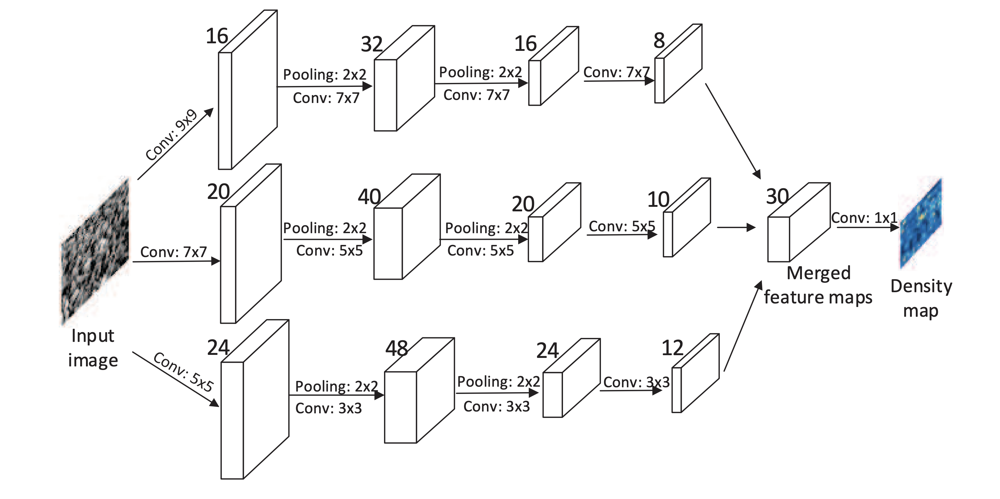


For this MCNN, the input is the image and its output is a crowd density map, whose integral gives the overall crowd count. 
Different columns of this MCNN corresponds to filters with receptive fields of different sizes, so that the features learnt by each column CNN is adaptive to large variation in people/head size due to perspective effects. 
We implemented a MCNN containing three columns of covolutional neural networks whose filters have different sizes (large, medium and small).

The MCNN algorithm was originally implemented in Python 2.7. We updated the code and implemented the algorithm in Python 3.7 using PyTorch.
With the limited computation resource, we reduced the architecture to 3 columns and trained the network using the ShanghaiTech data set A for 2000 episodes.

## Results

The following figure presents the training curves of the MCNN algorithm after 2000 episodes. One can observe the significant reduction in loss and mean errors.


|Original | Ground Truth | Density Map | Crowd Detection |
| --- | --- | --- | --- |
| 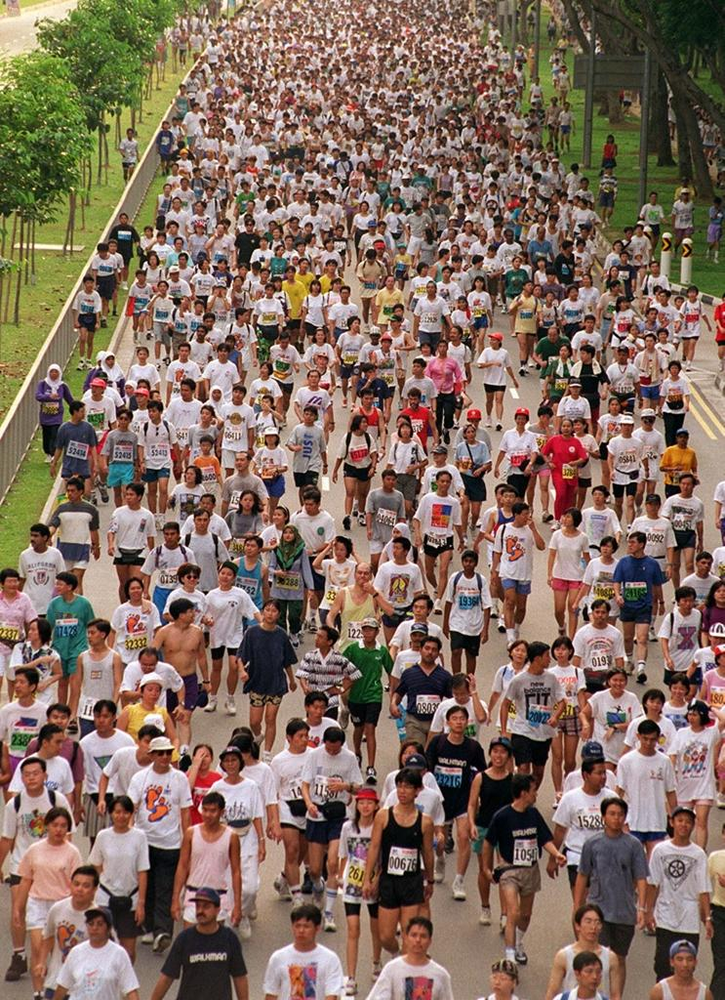 | 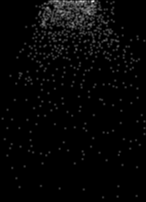 |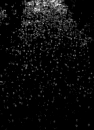 |  |
| 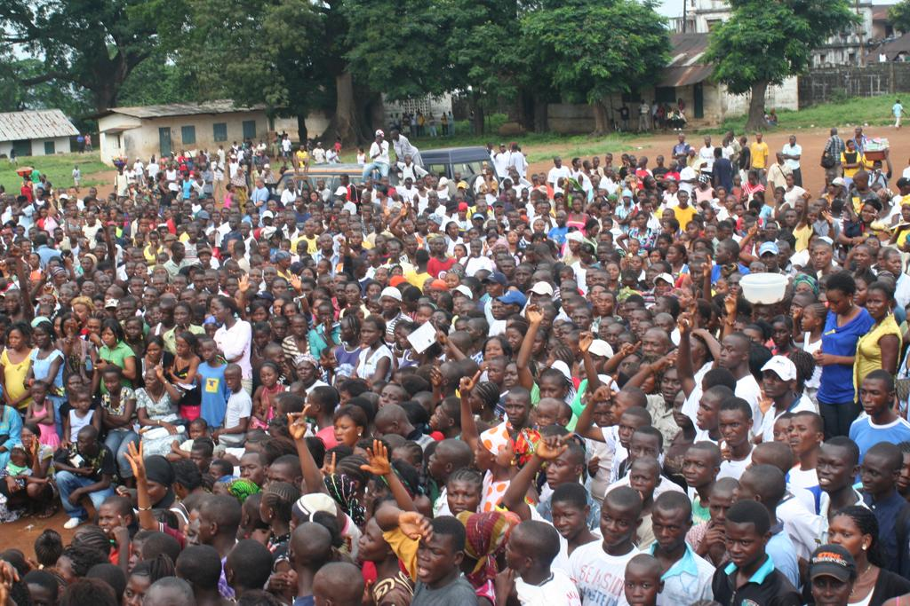 | 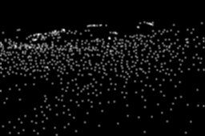 |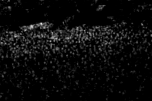 |  |
| 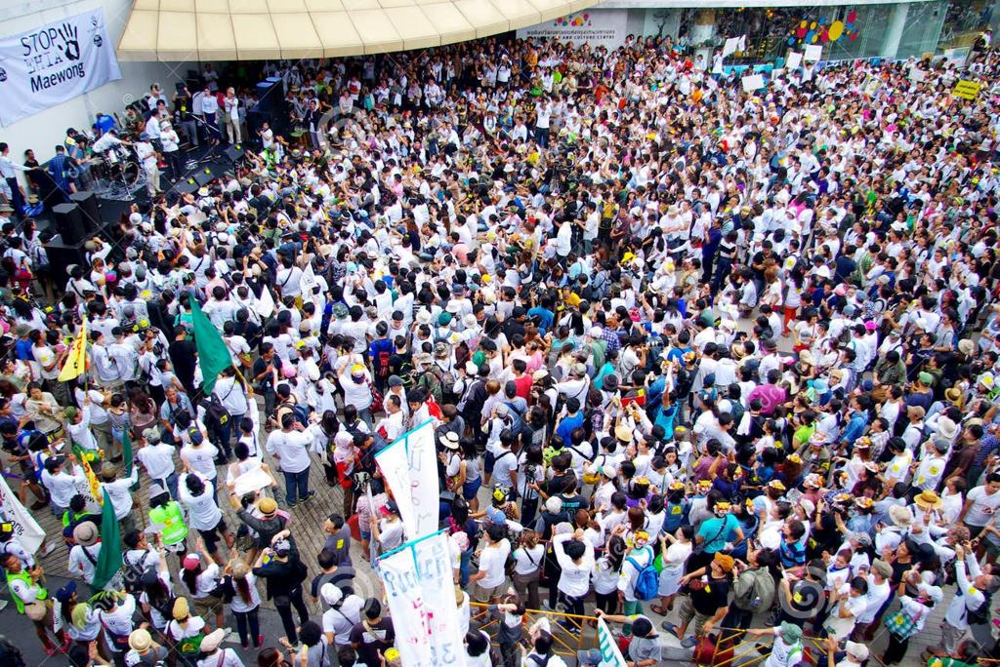 | 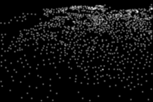 |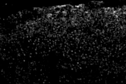 |  |
| 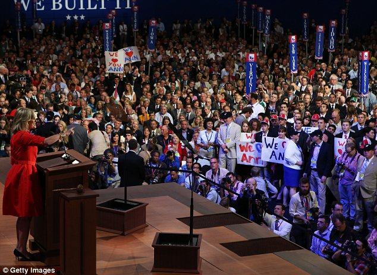 | 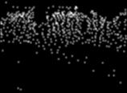 |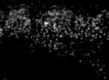 |  |
| 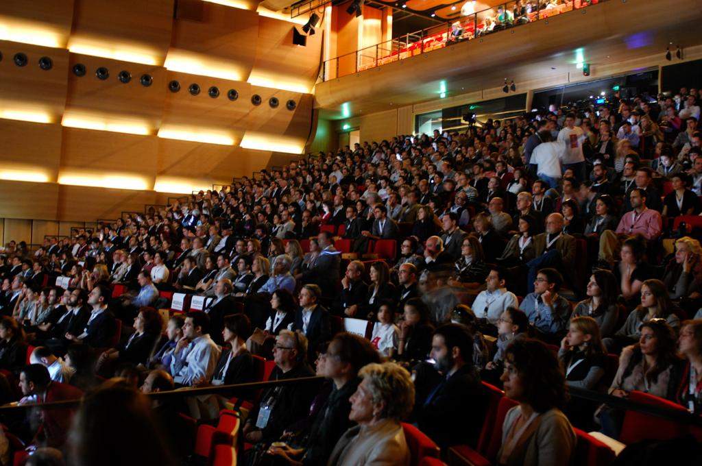 | 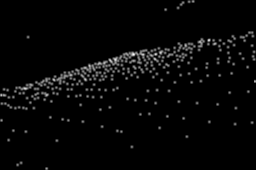 |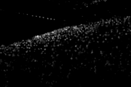 |  |
| 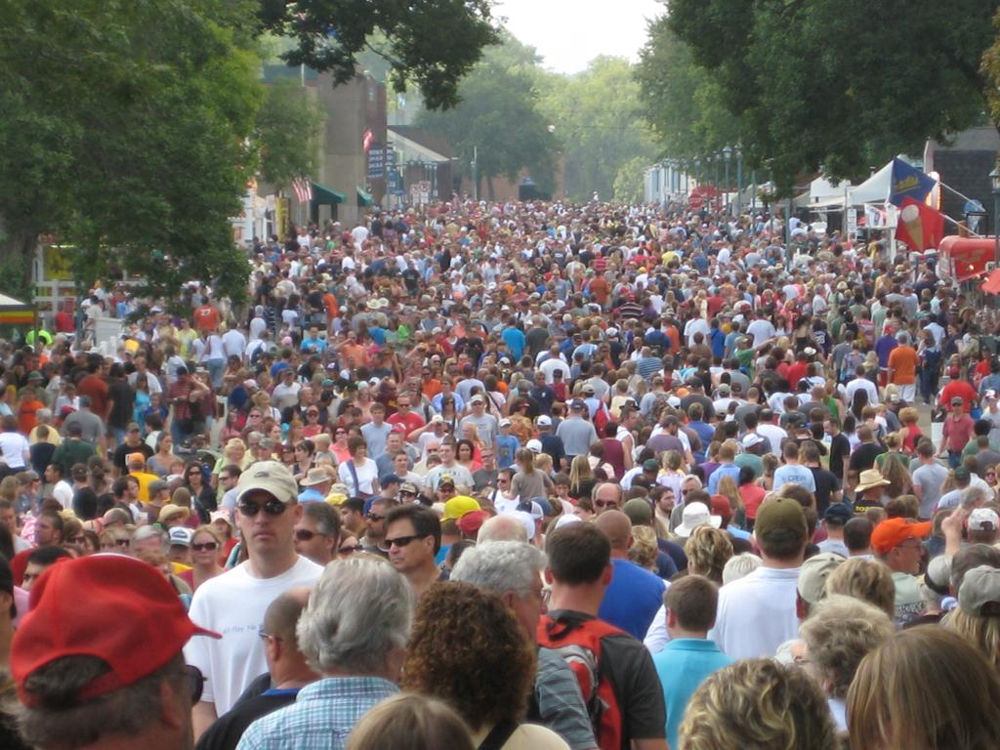 | 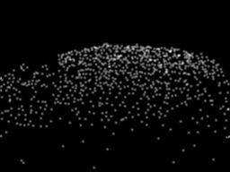 |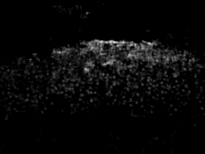 |  |
| 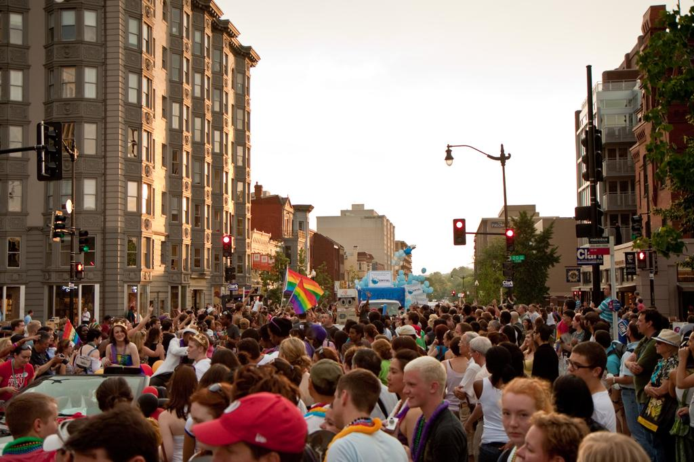 | 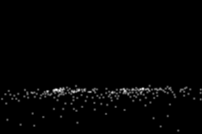 |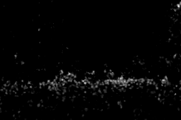 |  |

## Conclusion

## References
[1] M. Abdou and A. Erradi, "Crowd Counting: A Survey of Machine Learning Approaches," 2020 IEEE International Conference on Informatics, IoT, and Enabling Technologies (ICIoT), Doha, Qatar, 2020, pp. 48-54, doi: 10.1109/ICIoT48696.2020.9089594.

[2] C.C. Loy, K. Chen, S. Gong, T Xiang. “Crowd Counting and Profiling: Methodology and Evaluation”. Modeling, Simulation and Visual Analysis of Crowds. The International Series in Video Computing, vol 11. Springer, New York, NY

[3] A. Fagette, N. Courty, D. Racoceanu, and J.-Y. Dufour,  “Unsupervised dense    crowd    detection    by    multiscale    texture    analysis,” Pattern Recognition Letters, vol. 44, pp. 126 – 133, 2014, pattern Recognition and   Crowd   Analysis. 

[4] Y. Zhang, D. Zhou, S. Chen, S. Gao, and Y. Ma, "Single-image crowd counting via multi-column convolutional neural network," In Proceedings of the IEEE conference on computer vision and pattern recognition, pp. 589-597. 2016.


You can use the [editor on GitHub](https://github.com/haigeandychen/CS7641-Crowd/edit/master/README.md) to maintain and preview the content for your website in Markdown files.

Whenever you commit to this repository, GitHub Pages will run [Jekyll](https://jekyllrb.com/) to rebuild the pages in your site, from the content in your Markdown files.

### Markdown

Markdown is a lightweight and easy-to-use syntax for styling your writing. It includes conventions for

```markdown
Syntax highlighted code block

# Header 1
## Header 2
### Header 3

- Bulleted
- List

1. Numbered
2. List

**Bold** and _Italic_ and `Code` text

[Link](url) and 
```

For more details see [GitHub Flavored Markdown](https://guides.github.com/features/mastering-markdown/).

### Jekyll Themes

Your Pages site will use the layout and styles from the Jekyll theme you have selected in your [repository settings](https://github.com/haigeandychen/CS7641-Crowd/settings). The name of this theme is saved in the Jekyll `_config.yml` configuration file.

### Support or Contact

Having trouble with Pages? Check out our [documentation](https://help.github.com/categories/github-pages-basics/) or [contact support](https://github.com/contact) and we’ll help you sort it out.
